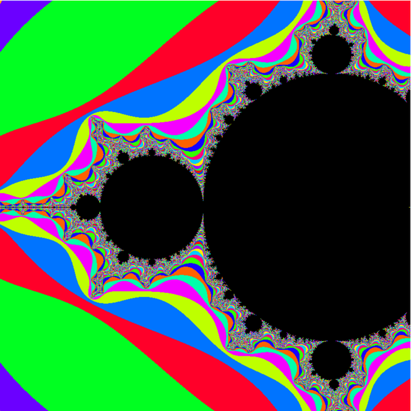
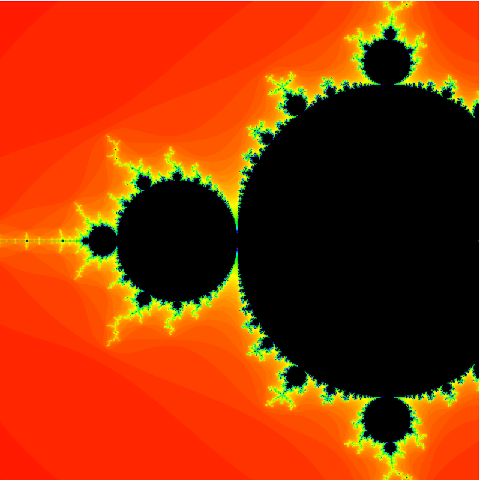

# Mandelbrot

A naive Mandlebrot set demonstration inspired by [Peter Westmacott's excellent talk at re:Clojure](https://www.youtube.com/watch?v=zP1qStsGlFE).

This version is written in Clojurescript with a simple **click to zoom in** function allowing you to explore
areas like the [Seahorse Valley](http://www.alunw.freeuk.com/seahorsevalley.html).

You can try it on my [GitHub Page](http://guess-burger.github.io/mandelbrot-cljs/).

## Running locally + Getting a REPL

When starting shadow-cljs with `shadow-cljs watch app` make note of the nREPL port logged out.
Connect to `http://localhost:8020/mandelbrot-cljs/` to view the mandelbrot.
Create a remote REPL that connects to that specific port.
Once your REPL is running use the command `(shadow/repl :app)` to connect to the shadow-cljs REPL

### Cursive
As Cursive is my editor of choice, there are a number of hoops to jump through

You can make intellij copy the `.shadow-cljs/nrepl.port` file to `.nrepl-port` as a "Before Launch" action
to make Cursive auto-connect to nRepl. This works by making it think it's a lein project see
https://github.com/thheller/shadow-cljs/issues/524

## Colour choice
I've implemented two options for rendering the values _outside_ the Mandelbrot set based on their
iteration counts.

### Golden-Ratio Random
Use this for a clear view of the different bands/iteration counts.
This scheme is based on the concepts in this blog post https://martin.ankerl.com/2009/12/09/how-to-create-random-colors-programmatically/

### Gradient
Use this colour scheme for aesthetics, it's much nicer to look at!

